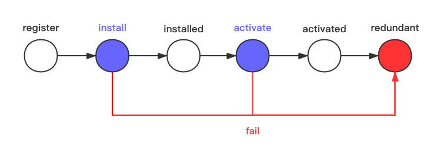
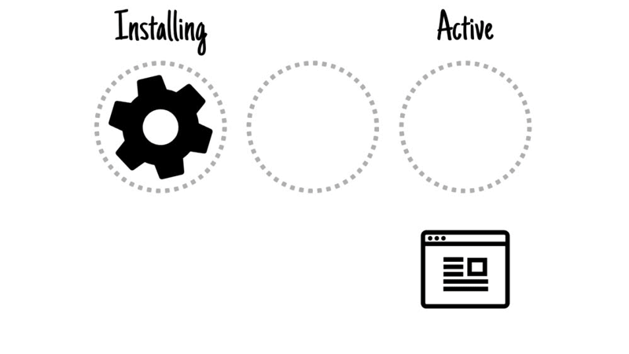
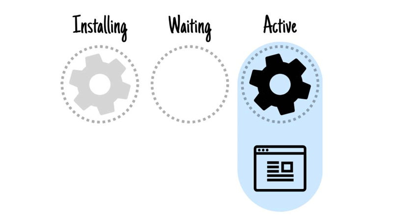
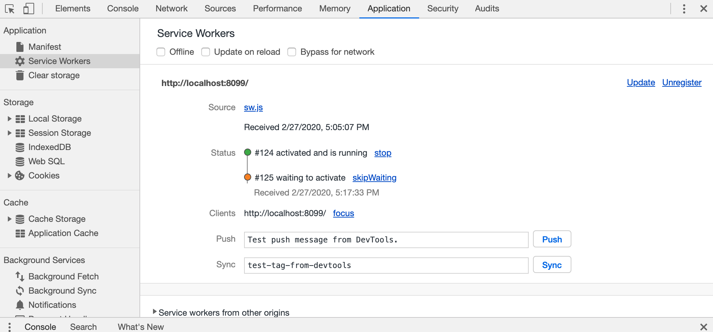

# 从 Service Worker 到 workbox

---

### 官方解释
> Service Worker 是浏览器在后台独立于网页运行的脚本，它打开了通向不需要网页或用户交互的功能的大门。

[Service Worker：简介  |  Web Fundamentals  |  Google Developers](https://developers.google.com/web/fundamentals/primers/service-workers?hl=zh-cn)
___


---

### 技术特点
+ 独立于主线程 (不可以操作 Dom)
+ 仅仅支持 https （本地调试localhost除外）
+ 大量使用了 promise
+ 缓存需要结合 Cache Storage 使用

---

### 创建一个 Demo 级的 service-worker
___
```js
// index.html
if ('serviceWorker' in navigator) {
  navigator.serviceWorker.register('/service-worker.js')
    .then(function (registration) {
       console.log('Service Worker registration successfully: ');
    })
    .catch(function (err) {
       console.log('Service Worker registration failed: ');
    });
}
```
___
```js
// service-worker.js
var id = Math.random();
var CACHE_NAME = 'SERVICE_WORKER_DEMO';

var preCacheList = [
  '/static/images/pig.png',
];

self.addEventListener('install', function(event) {
  console.log(`[lifecycle][${id}]: install`)
  // self.skipWaiting();
  event.waitUntil(
    caches.open(CACHE_NAME).then(cache => cache.addAll(preCacheList))
  );
});

self.addEventListener('activate', function(event) {
  console.log(`[lifecycle][${id}]: activate`)
  event.waitUntil(
    caches.keys().then(keys => Promise.all(
      keys.map(key => {
        if (key === CACHE_NAME) return caches.delete(key);
      })
    )).then(() => {
      console.log(`[lifecycle][${id}]: activated`);
    })
  );
});

self.addEventListener('fetch', function(event) {
  event.respondWith(
    caches.match(event.request)
      .then(function(response) {
        if (response) return response;
        return fetch(event.request).then(function(response) {
          if (response && response.status === 200 && response.type === 'basic') {
            var responseClone = response.clone();
            caches.open(CACHE_NAME)
              .then(function(cache) {
                cache.put(event.request, responseClone);
              });
            return response;
          }
          return response;           
        });
      })
  );
});
```

---

### 生命周期

___
#### install
适合做 precache
```js
var preCacheList = [
  '/static/images/pig.png',
  '/static/images/snake.png',
  '/static/images/dragon.png',
];

self.addEventListener('install', function(event) {
  console.log(`[lifecycle]: install`)
  // TODO
  event.waitUntil(
    caches.open(CACHE_NAME).then(cache => cache.addAll(preCacheList))
  );
});
```
___
为了防止 service-worker 在安装 precache 的过程中占用页面首屏的带宽，我们需要在页面加载完毕后再注册 service-worker。

```js
if ('serviceWorker' in navigator) {
  window.addEventListener('load', function() {
    navigator.serviceWorker.register('/sw.js').then(reg => {
    });
  });
}
```
___
#### activate
activate 是指 service-worker 完成了安装过程。开始激活，激活后便可以开始工作。关于 activate， 面对之前已经安装过 service-worker 和没有安装过 service-worker 是两种情况。
___
1. 没有安装过
   

___
1. 安装过
   

___
当目前已经 install 了一个 service-worker，我们更新了service-worker 内容时，聪明的浏览器会比对出内容的变化，并且 install 一个新的 service-worker。
然后新的 service-worker 等待老的 service-worker redundant（用户关闭或者刷新页面）。新的 service-worker 便开始工作。
___
下图是调试在浏览器会出现以下情况，新的 service-worker  "waiting" 老的 service-worker  交接工作。
___

如果我们想新的 service-worker install 后直接开始工作不等待老的 service-worker 怎么办？
___
下面代码中 "self.skipWaiting()" 的作用是让新的 service-worker 跳过等待直接接管工作。
```js
self.addEventListener('install', function(event) {
  console.log(`[lifecycle][${id}]: install`)
  self.skipWaiting();
  event.waitUntil(
    caches.open(CACHE_NAME).then(cache => cache.addAll(preCacheList)).then(function() {
      console.log(`[lifecycle][${id}]: wait install`);
    })
  );
});
```
___
由于在新的 service-worker 激活前的 install 阶段 我们已经 ”培养“ 了 新的 service-worker 的 precache。在 activate 阶段我们可以 ”铲除“ 老的 service-worker 的 precache。

---

### fetch

---

### workbox

workbox 是对service-worker 的封装。让使用 service-worker 更加简单。

[Workbox  |  Google Developers](https://developers.google.com/web/tools/workbox)
___
#### workbox 有什么好处？
___
+ 封装了 precaching
+ 封装了 请求策略
+ 有 webpack 插件做配合
___
#### 请求策略
___

Stale-While-Revalidate


___
Cache First


___
Network First


___
Network Only


___
Cache Only


